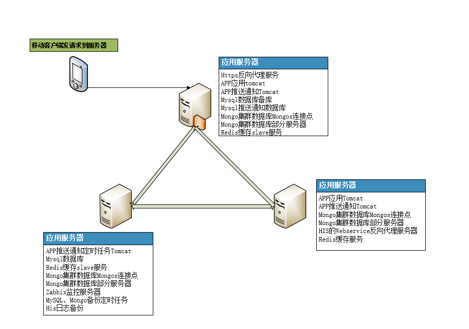
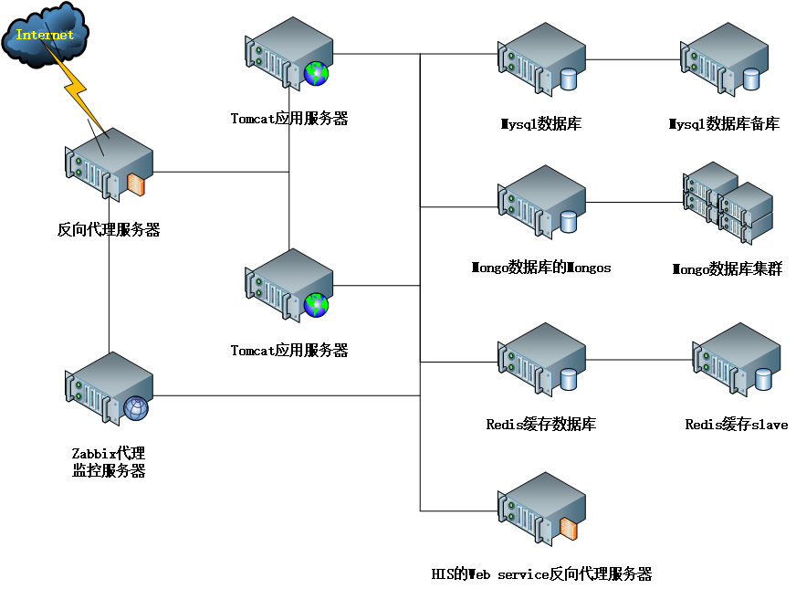

# 掌上就医服务器部署情况 #

## 服务器一览 ##



### 掌上就医集群服务器01 ###

#### 主要运行的应用服务
- 掌上就医nginx代理服务
- 掌上就医tomcat服务
- 掌上就医mysql备份服务
- 掌上就医mongos服务
- 掌上就医mongo集群部分服务
- 掌上就医redis缓存slave服务
- 掌上就医nginx管理端服务

#### 定时任务 ####

```
#nginx日志切割
59 23 * * * /opt/task/cut_nginx_log.sh > /dev/null 2>&1

#自动判断容器启动
*/5 * * * * /opt/task/start_docker.sh >> /opt/task/log/start_docker.log

#删除30天之前的tomcat日志
00 12 * * * /opt/script/del_tomcat_log.sh > /dev/null 2>&1

#kettle自动统计
50 1 * * * /opt/kettle/statistics.sh
```

### 掌上就医集群服务器02 ###

#### 主要运行的应用服务
- 掌上就医mysql主服务
- 掌上就医mongos服务
- 掌上就医mongo集群部分服务
- 长期保存查看日志的mongo服务
- zabbix监控服务，对各服务器及应用监控
- 掌上就医mysql每天备份定时任务
- 掌上就医请求his日志每天备份定时任务，并把每天备份的日志复制到长期保存日志的mongo中
- 掌上就医redis缓存slave服务

#### 定时任务 ####

```
#备份mysql数据库
00 04 * * * /data/backup/mysql/mysql_backup.sh

#备份mongo数据库
00 05 * * * /data/backup/mongo/mongo_backup.sh

#获取创建时间超过一天且仍处于未支付状态的挂号单
00 */5 * * * /opt/task/mongo/mongo_count_registration.sh

#zabbix 监控IO
*/1 * * * * /usr/bin/iostat -k -x -d 1 3 >/data/zabbix/iostat_output 2>&1

#导出ws_log
15 2 * * * /opt/backup/mongo/backup.sh

#导入ws_log
45 2 * * * /opt/backup/mongo/wsLogImp.sh
```

### 掌上就医集群服务器03 ###

#### 主要运行的应用服务
- 掌上就医tomcat服务
- HIS 的 Web Service [反向代理](./服务器03/opt/docker/ihos/nginx/nginx.conf) 服务
- 掌上就医mongos服务
- 掌上就医mongo集群部分服务
- 掌上就医redis缓存服务
- HIS 的 Web Service反向代理nginx定时任务，日志按天分割，及日志保留天数策略

#### 定时任务 ####

```
#备份HIS Web Service nginx日志
10 1 * * * /opt/backup/nginx/backup.sh

#zabbix 监控IO
*/1 * * * * /usr/bin/iostat -k -x -d 1 3 >/data/zabbix/iostat_output 2>&1

#删除30天之前的tomcat日志
00 12 * * * /opt/script/del_tomcat_log.sh > /dev/null 2>&1
```


## 各类应用详细 ##



### docker ###
- 各服务器都采用docker容器部署应用
- 各服务器docker都安装在 /opt/docker/docker/ 内
- 正式服务器的容器设置都保存在 /opt/docker/ihos/docker-compose.yml 内

### nginx ###

#### https反向代理服务 ####
- https反向代理服务
- 配置和日志保存位置：/opt/https

#### 掌上就医的nginx反向代理 ####
- 配置和日志保存位置：/opt/docker/ihos/nginx_proxy/

#### 掌上就医nginx管理端服务 ####
- 配置和日志保存位置：/opt/docker/ihos/nginx_admin/

#### his的webservice的nginx反向代理 ####
- 反向代理his的webservice服务器
- 配置和日志保存位置：/opt/docker/ihos/nginx_proxy/

### tomcat ###

#### 掌上就医tomcat ####
- 部署掌上就医web工程，共4个tomcat，分布在服务器01、03上
- web工程和日志保存位置：各服务器的/opt/docker/ihos/pep1/、/opt/docker/ihos/pep2/

### mysql ###

#### 掌上就医mysql ####
- 保存掌上就医业务的关系型数据，配置了两个mysql进行主从复制备份
- 用户：root 密码：123456
- 用户：ihos 密码：123456
- 数据及配置保存位置：/opt/docker/ihos/mysql/、/opt/docker/ihos/mysql_slave/

### redis ###

#### 掌上就医redis ####
- 保存掌上就医缓存数据
- 密码：123456
- 数据及配置保存位置：/opt/docker/ihos/redis

### mongo ###

#### 掌上就医mongo ####
- 保存掌上就医非关系型数据。采用集群配置，包括1个mongos，3个集群配置副本，2个分片，每个分片包含3个副本，其中分片的第3个副本为延时24复制副本
- 用户库：admin 用户：admin 密码：123456
- 用户库：admin 用户：ihos 密码：ihos
- 数据及配置保存位置：/opt/docker/ihos/mongo_*

#### 掌上就医长期保存log的mongo ####
- 为减轻保存业务数据mongo的存储压力，保存业务数据mongo只保存固定大小的全部log，保存不下的筛选掉不重要的数据后保存在该mongo中
- 用户库：admin 用户：admin 密码：123456
- 用户库：admin 用户：ihos 密码：ihos
- 数据及配置保存位置：/data/mongo_log

### zabbix ###
- 对服务器和应用进行监控

#### zabbix的mysql ####
- 保存zabbix产生的监控数据
- 用户：root 密码：Proper123
- 用户：zabbix 密码：zabbix
- 数据及配置保存位置：/opt/docker/zabbix/mysql/

#### zabbix的service ####
- zabbix的服务

#### zabbix的web ####
- zabbix的web页面服务器
- 用户：admin 密码：zabbix

#### zabbix的client ####
- 使用deb安装包，安装在每个被监控的服务器上，定时和service之间传送监控数据。client的端口号为10050
- 自定义监控数据的key保存在 /etc/zabbix/zabbix_agentd.conf.d/userParameter.conf 内
- 监控脚本保存在 /opt/zabbix/ 内

### 定时任务 ###
- 查看定时任务命令：crontab -l

#### nginx日志定时处理及判断nginx服务状态 ####
- 对nginx日志进行分割，删除超期的日志
- 定时脚本位置：/opt/task/

#### kettle统计定时任务 ####
- 使用kettle每天对掌上就医业务数据进行统计
- 定时脚本位置：/opt/kettle/

#### mysql定时备份 ####
- 每天对mysql进行导出备份
- 定时脚本位置：/data/backup/mysql/

#### his日志定时备份 ####
- 每天对mysql进行导出备份
- 定时脚本位置：/opt/backup/mongo/

### ntp ###
- 所有服务器同01服务器进行时间同步
- ntp各服务器配置文件位置：/etc/ntp.conf
