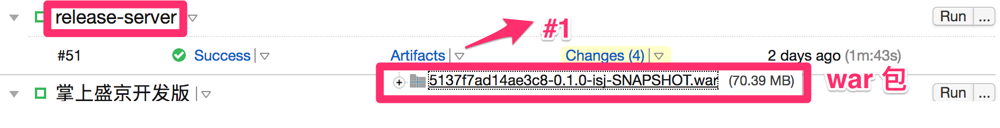
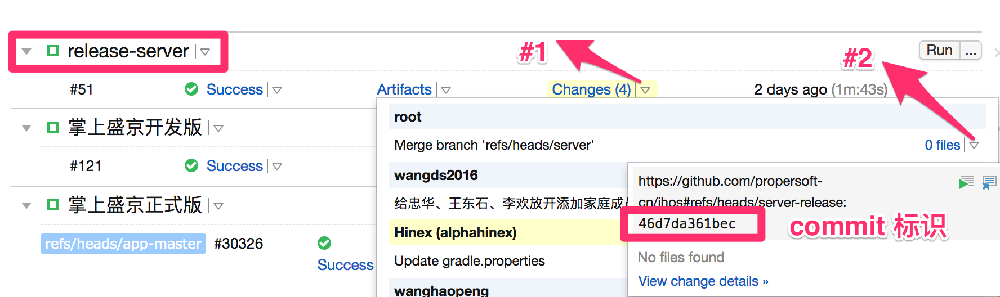

# 掌上就医服务器更新流程 #

## 从 TeamCity 下载最新的 war 包

* TeamCity 地址：[https://cloud.propersoft.cn/teamcities/](https://cloud.propersoft.cn/teamcities/)
* 账号：core / eroc
* 找到最新打出的 war 包并下载。**下载后需将 war 包文件名修改为 `ihos.war`**



## 更新当前服务器工程commit标识 ##

- server-release：c9dc3ef593f2



## 应用服务部署模式


共有两台服务器（101、103）需部署 web 应用，每台服务器上部署两个实例。通过前面的负载均衡器（101 上的 nginx）向四个应用服务实例分发流量。


## 更新流程 ##

服务器账号：deploy / Dy@c1MD#@UT

### 更新101第一台Tomcat服务器 ###
- 登录192.168.1.101服务器。
- 修改nginx配置文件 `/opt/docker/ihos/nginx_proxy/nginx.conf`，将 `service_ihos` 中的要升级的Tomcat服务器注释掉，以注释 101 第一台服务器为例，修改如下：
```
upstream service_ihos {
    #server 192.168.1.101:39091 max_fails=5 fail_timeout=10s;
    server 192.168.1.101:39092 max_fails=5 fail_timeout=10s;
    server 192.168.1.103:39091 max_fails=5 fail_timeout=10s;
    server 192.168.1.103:39092 max_fails=5 fail_timeout=10s;
}
```
将 `server 192.168.1.101:39091 max_fails=5 fail_timeout=10s;` 修改为 `#server 192.168.1.101:39091 max_fails=5 fail_timeout=10s;`

- 重启nginx容器
```
sudo docker restart ihos_nginx_proxy_official_1
```
- **等待30分钟后**，登录192.168.1.101服务器，停止要升级的101第一台Tomcat容器
> 为减少停止 tomcat 对正式环境中在途请求以及后台线程任务的影响，请尽量保证等待时长后再执行停止 tomcat 服务的操作
```
sudo docker stop ihos_pep1_official_1
```
- 删除tomcat下的工程和war包
```
sudo rm -rf /opt/docker/ihos/pep1/tomcat/webapps/ihos.war
sudo rm -rf /opt/docker/ihos/pep1/tomcat/webapps/ihos/
```
- 将要更新的war包复制到原路径下

> 注：`deploy` 用户没有直接上传文件至 `/opt/docker/isj_official/pep1/tomcat/webapps` 路径的权限，可先将 war 包上传至 `/home/deploy` 路径下，再使用 `sudo cp /home/deploy/isjh.war /opt/docker/isj_official/pep1/tomcat/webapps/` 将文件复制过去

- 启动docker容器
```
sudo docker start ihos_pep1_official_1
```
- 等待docker容器启动成功后，登录192.168.1.101服务器，改回原来nginx配置，取消101第一台Tomcat注释，即将 `# server 192.168.1.101:39091 max_fails=5 fail_timeout=10s;` 改回 `server 192.168.1.101:39091 max_fails=5 fail_timeout=10s;`

- 重启nginx容器，完成101第一台Tomcat服务器更新
```
sudo docker restart ihos_nginx_proxy_official_1
```

- 查看日志检查服务启动是否有异常，日志文件格式为 `logFile.yyyy-MM-dd.log`，后面为时间戳
```
tail -f /opt/docker/ihos/pep1/tomcat/logs/logFile.2017-07-24.log
```

### 更新其他三个应用服务器实例

更新101第二台Tomcat服务器及103两台服务器升级步骤与101第一台一升级一致，只需将 `pep1` 替换成 `pep2`，并更换 ip 地址即可


## 灰度测试

在正式上线之前，可使用 [灰度测试](https://www.zhihu.com/question/28734998) 的方式，验证变更的正确性，减轻 bug 对生产环境和正式用户产生的影响。

灰度服务器设定为 `192.168.1.102:39091`，即 `ihos_pep1_official_1` 容器

开发完成代码提交merge成功后， TeamCity会自动发布最新war包，到102 pep1上，下载灰度版本的 APP，即可在该节点上完成所有功能的验证。

- 当需要开放部分用户到灰度环境时修改以下

> 例如：将用户ID以 1、3、5、7开头的用户开放进入灰度环境
需要修改 101 服务器 /opt/docker/ihos/nginx_proxy/sites-enabled/ihos 配置文件
找到以下内容去掉注释：
```
    #id 1、3、5、7开头
      if ($http_x_pep_token ~* "(eyJpZCI6IjE.*$|eyJpZCI6IjM.*$|eyJpZCI6IjU.*$|eyJpZCI6Ijc.*$)") {
          set $a 1;
      }
```
注：不开放时注释掉以上配置即可。

灰度版本的 APP 为 https://cloud.propersoft.cn/teamcities/viewType.html?buildTypeId=IHos_App 中最新构建的内容。
