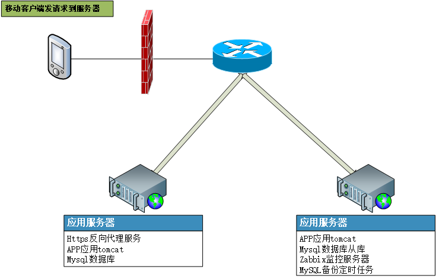
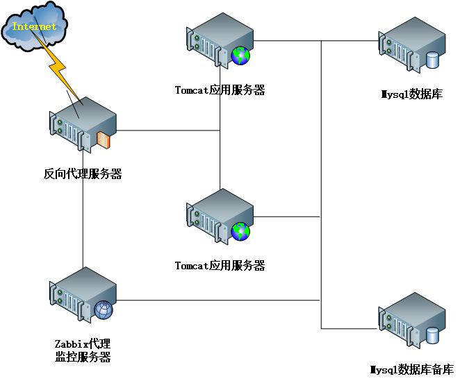

# 掌上办公服务器部署情况 #

## 服务器一览 ##



### 掌上办公集群服务器01 ###

#### 主要运行的应用服务
- 掌上办公nginx代理服务
- 掌上办公tomcat服务
- 掌上办公mysql服务

#### 定时任务 ####

```
#nginx日志切割
59 23 * * * /opt/task/cut_nginx_log.sh > /dev/null 2>&1

#自动判断容器启动
*/5 * * * * /opt/task/start_docker.sh >> /opt/task/log/start_docker.log

#删除30天之前的tomcat日志
00 12 * * * /opt/script/del_tomcat_log.sh > /dev/null 2>&1
```

### 掌上办公集群服务器02 ###

#### 主要运行的应用服务
- 掌上办公tomcat服务
- 掌上办公mysql从服务
- zabbix监控服务，对各服务器及应用监控
- 掌上办公mysql每天备份定时任务

#### 定时任务 ####

```
#备份mysql数据库
00 04 * * * /data/backup/mysql/mysql_backup.sh

#自动判断容器启动
*/5 * * * * /opt/task/start_docker.sh >> /opt/task/log/start_docker.log

#删除30天之前的tomcat日志
00 12 * * * /opt/script/del_tomcat_log.sh > /dev/null 2>&1
```


## 各类应用详细 ##



### docker ###
- 各服务器都采用docker容器部署应用
- 各服务器docker都安装在 /opt/docker/docker/ 内
- 正式服务器的容器设置都保存在 /opt/docker/icmp/docker-compose.yml 内

### nginx ###

#### https反向代理服务 ####
- https反向代理服务
- 配置和日志保存位置：/opt/https

#### 掌上办公的nginx反向代理 ####
- 配置和日志保存位置：/opt/docker/icmp/nginx_proxy/

### tomcat ###

#### 掌上办公tomcat ####
- 部署掌上办公web工程，共4个tomcat，分布在服务器01、02上
- web工程和日志保存位置：各服务器的/opt/docker/icmp/pep1/、/opt/docker/icmp/pep2/

### mysql ###

#### 掌上办公mysql ####
- 保存掌上办公业务的关系型数据，配置了两个mysql进行主从复制备份
- 用户：root 密码：123456
- 用户：icmp 密码：123456
- 数据及配置保存位置：/opt/docker/icmp/mysql/、/opt/docker/icmp/mysql_slave/

### zabbix ###
- 对服务器和应用进行监控

#### zabbix的mysql ####
- 保存zabbix产生的监控数据
- 用户：root 密码：Proper123
- 用户：zabbix 密码：zabbix
- 数据及配置保存位置：/opt/docker/zabbix/mysql/

#### zabbix的service ####
- zabbix的服务

#### zabbix的web ####
- zabbix的web页面服务器
- 用户：admin 密码：zabbix

#### zabbix的client ####
- 使用deb安装包，安装在每个被监控的服务器上，定时和service之间传送监控数据。client的端口号为10050
- 自定义监控数据的key保存在 /etc/zabbix/zabbix_agentd.conf.d/userParameter.conf 内
- 监控脚本保存在 /opt/zabbix/ 内

### 定时任务 ###
- 查看定时任务命令：crontab -l

#### nginx日志定时处理及判断nginx服务状态 ####
- 对nginx日志进行分割，删除超期的日志
- 定时脚本位置：/opt/task/

#### mysql定时备份 ####
- 每天对mysql进行导出备份
- 定时脚本位置：/data/backup/mysql/

### ntp ###
- 所有服务器同01服务器进行时间同步
- ntp各服务器配置文件位置：/etc/ntp.conf
